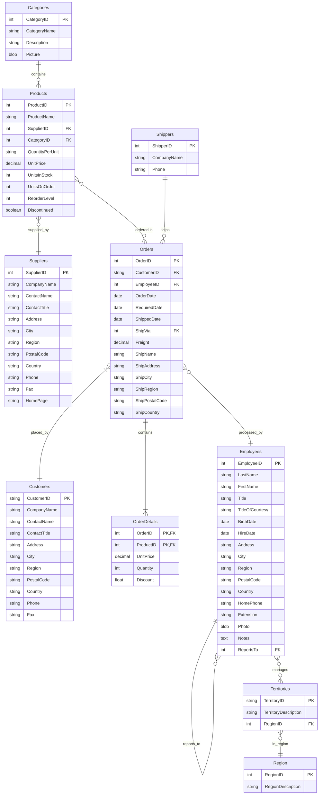

# Northwind DAB REST and GraphQL API Demo

A modern REST and GraphQL API built with Microsoft Data API Builder (DAB) using the classic Northwind database. This project demonstrates how to create a containerized API with automatic Swagger documentation and GraphQL endpoint.

## 📊 Database Schema



## 🚀 Features

- **REST API** endpoints for Northwind database entities
- **GraphQL API** with full query capabilities
- **Swagger/OpenAPI** documentation
- **Docker** containerization
- **SQL Server** database with Northwind sample data
- **Cross-Origin Resource Sharing (CORS)** enabled
- **Anonymous access** for easy testing

## 🛠️ Prerequisites

- [Docker Desktop](https://www.docker.com/products/docker-desktop/)
- [PowerShell](https://github.com/PowerShell/PowerShell)

## 🏃‍♂️ Quick Start

1. Clone the repository:
   ```bash
   git clone https://github.com/vvidov/DabRestGraphQLBaseDemo.git
   cd DabRestGraphQLBaseDemo
   ```

2. Start the containers:
   ```powershell
   .\start.ps1
   ```

3. Access the APIs:
   - Swagger UI: http://localhost:8080/swagger
   - REST API: http://localhost:8080/api
   - GraphQL Playground: http://localhost:8080/graphql

## 🔐 Environment Configuration

Before running the application, you need to set up your environment variables:

1. Copy the `.env.template` file to create a new `.env` file:
   ```bash
   cp .env.template .env
   ```

2. Edit the `.env` file with your secure values:
   - `MSSQL_SA_PASSWORD`: Set a secure password for SQL Server SA account
   - `MSSQL_PID`: SQL Server edition (default: Developer)
   - `CONNECTION_STRING`: Database connection string (update with your SA password)

⚠️ **Security Note**: 
- Never commit the `.env` file to version control
- Use strong passwords in production
- The `.env` file is already added to `.gitignore`

## 🔌 DAB API Container

The project uses Data API Builder, a powerful tool from Microsoft that automatically generates REST and GraphQL APIs from your database. Our DAB container is configured using:

- Base image: `mcr.microsoft.com/dotnet/sdk:8.0`
- Configuration: Uses `dab-config.json` for API definitions
- Exposed port: 8080
- Runs as a containerized service using the DAB CLI

### Key Features of Data API Builder

1. **API Support**:
   - REST endpoints (POST, GET, PUT, PATCH, DELETE)
   - GraphQL endpoints with queries and mutations
   - OpenAPI/Swagger support

2. **Database Support**:
   - SQL Server and Azure SQL
   - PostgreSQL and Azure Database for PostgreSQL
   - MySQL and Azure Database for MySQL
   - Azure Cosmos DB (NoSQL and PostgreSQL)
   - Azure SQL Data Warehouse

3. **Advanced Capabilities**:
   - Multiple simultaneous data sources
   - Support for tables, views, and stored procedures
   - Built-in filtering, sorting, and pagination
   - In-memory caching
   - Relationship navigation
   - Dynamic schemas

4. **Security Features**:
   - OAuth2/JWT authentication
   - EasyAuth and Microsoft Entra Identity integration
   - Role-based authorization
   - Item-level security via policy expressions

5. **Developer Experience**:
   - Zero-code configuration
   - Cross-platform CLI
   - Docker-friendly container
   - Native OpenAPI support
   - Automatic CRUD operations

## 🔌 Using as a Template

To adapt this for your own database:

1. Keep the DAB container setup:
   ```dockerfile
   # dab/Dockerfile remains unchanged
   FROM mcr.microsoft.com/dotnet/sdk:8.0
   RUN dotnet tool install -g Microsoft.DataApiBuilder
   ```

2. Update database connection in `dab-config.json`:
   ```json
   {
     "data-source": {
       "database-type": "mssql",  // or postgresql, mysql, etc.
       "connection-string": "Server=db;Database=YourDatabase;..."
     }
   }
   ```

3. Define your entities:
   ```json
   {
     "entities": {
       "YourEntity": {
         "source": "DatabaseTable",
         "rest": {
           "path": "/your-endpoint"
         },
         "permissions": [
           {
             "role": "anonymous",
             "actions": ["*"]
           }
         ]
       }
     }
   }
   ```

Benefits:
- Zero-code API development
- Automatic documentation
- Built-in GraphQL support
- Easy configuration
- Production-ready middleware

## 🔌 Using as a Base Repository

This repository provides a ready-to-use Data API Builder setup with SQL Server and Northwind database. You can use it as a base for your own projects to quickly get a REST and GraphQL API.

Follow these steps to use it in your project:

### 1. Create Your Project Directory
```bash
mkdir my-project
cd my-project
```

### 2. Add This Repository as a Submodule
```bash
git init
git submodule add https://github.com/vvidov/DabRestReactDemo.git dab-base
```

### 3. Set Up Environment Variables
Create a new file named `.env` in the `dab-base` directory with the following content:
```env
MSSQL_SA_PASSWORD=YourStrongPassword123!
MSSQL_PID=Developer
CONNECTION_STRING=Server=db;Database=Northwind;User Id=sa;Password=YourStrongPassword123!;TrustServerCertificate=True
```
⚠️ Make sure to replace `YourStrongPassword123!` with a secure password.

### 4. Start the Base Services
```bash
cd dab-base
docker-compose up -d --build
```

### What You Get
Once running, you'll have access to:
- SQL Server with Northwind database (port 14330)
- REST API endpoints (http://localhost:8080/api)
- GraphQL endpoint (http://localhost:8080/graphql)
- Swagger documentation (http://localhost:8080/swagger)

You can now build your frontend application using these APIs.

## 📚 API Endpoints

### REST API

- Categories: `GET /api/categories`
- Products: `GET /api/products`
- Suppliers: `GET /api/suppliers`

All endpoints support standard HTTP methods (GET, POST, PUT, DELETE) for CRUD operations.

### GraphQL

Access the GraphQL playground at `/graphql` to:
- Write and test queries
- Explore the schema
- View documentation

## 📊 GraphQL Examples

Access the GraphQL playground at http://localhost:8080/graphql. Here are some sample queries:

### Query Products with Category and Supplier
```graphql
query {
  products {
    items {
      ProductName
      UnitPrice
      UnitsInStock
      category {
        CategoryName
        Description
      }
      supplier {
        CompanyName
        ContactName
        Country
      }
    }
  }
}
```

### Query Orders with Details and Related Entities
```graphql
query {
  orders {
    items {
      OrderID
      OrderDate
      customer {
        CompanyName
        ContactName
      }
      employee {
        FirstName
        LastName
      }
      shipper {
        CompanyName
      }
      orderDetails {
        items {
          UnitPrice
          Quantity
          product {
            ProductName
          }
        }
      }
    }
  }
}
```

### Query Categories with Related Products
```graphql
query {
  categories {
    items {
      CategoryName
      Description
      products {
        items {
          ProductName
          UnitPrice
          UnitsInStock
        }
      }
    }
  }
}
```

### Query Employees with Hierarchy and Territories
```graphql
query {
  employees {
    items {
      EmployeeID
      FirstName
      LastName
      Title
      manager {
        FirstName
        LastName
      }
      directReports {
        items {
          FirstName
          LastName
        }
      }
      territories {
        items {
          TerritoryDescription
          region {
            RegionDescription
          }
        }
      }
    }
  }
}
```

### Filtered Query with Arguments
```graphql
query {
  products(first: 5, filter: {UnitPrice: {gt: 15}}) {
    items {
      ProductName
      UnitPrice
      category {
        CategoryName
      }
    }
  }
}
```

### Mutation to Create a New Category
```graphql
mutation {
  createCategories(item: {
    CategoryName: "Organic Foods"
    Description: "Certified organic products"
  }) {
    CategoryID
    CategoryName
    Description
  }
}
```

### Mutation to Update a Product
```graphql
mutation {
  updateProducts(ProductID: 1, item: {
    UnitPrice: 20.00
    UnitsInStock: 100
  }) {
    ProductID
    ProductName
    UnitPrice
    UnitsInStock
  }
}
```

These queries demonstrate:
- Nested relationships (products → category → products)
- Many-to-one relationships (products → supplier)
- One-to-many relationships (categories → products)
- Many-to-many relationships (employees ↔ territories)
- Self-referential relationships (employee → manager/directReports)
- Filtering and pagination
- Basic mutations for data modification

Access the GraphQL playground to try these queries and explore the auto-generated documentation.

## 🗄️ Database Container

The project uses a Microsoft SQL Server container (`mcr.microsoft.com/mssql/server:2019-latest`) that can be customized for any database:

### Current Setup
- Base Image: SQL Server 2019
- Database: Northwind (sample database)
- Initialization: Automatic via `init.sql` script
- Credentials: Configurable via environment variables

### Customizing the Database
You can easily modify this setup for your own database:

1. Replace the initialization script:
   ```dockerfile
   # db/Dockerfile
   COPY init.sql /docker-entrypoint-initdb.d/
   ```
   - Replace `init.sql` with your own database schema and data

2. Update environment variables in `docker-compose.yml`:
   ```yaml
   environment:
     - ACCEPT_EULA=Y
     - SA_PASSWORD=YourPassword
     - MSSQL_PID=Developer
   ```

3. Modify DAB configuration:
   ```json
   // dab/dab-config.json
   {
     "data-source": {
       "database-type": "mssql",
       "connection-string": "Server=db;Database=YourDatabase;..."
     }
   }
   ```

This containerized approach ensures:
- Consistent database setup across environments
- Easy database version control
- Portable development environment
- Quick setup for new team members

## 🏗️ Project Structure

```
dabrestreactdemo/
├── dab/                    # Data API Builder configuration
│   ├── Dockerfile         # DAB API container setup
│   └── dab-config.json    # DAB configuration
├── db/                    # Database setup
│   ├── Dockerfile        # SQL Server container setup
│   └── init.sql          # Database initialization script
├── docker-compose.yml    # Container orchestration
├── start.ps1            # Startup script
└── README.md           # This file
```

## 🛡️ Security Note

This demo uses anonymous authentication for simplicity. In a production environment, you should:
- Implement proper authentication
- Use HTTPS
- Restrict CORS settings
- Secure database credentials

## 🤝 Contributing

1. Fork the repository
2. Create your feature branch (`git checkout -b feature/amazing-feature`)
3. Commit your changes (`git commit -m 'Add some amazing feature'`)
4. Push to the branch (`git push origin feature/amazing-feature`)
5. Open a Pull Request

## 📝 License

This project is licensed under the MIT License - see the LICENSE file for details.
